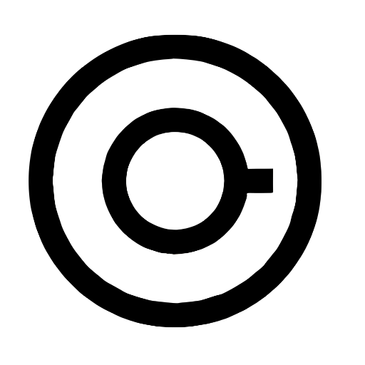
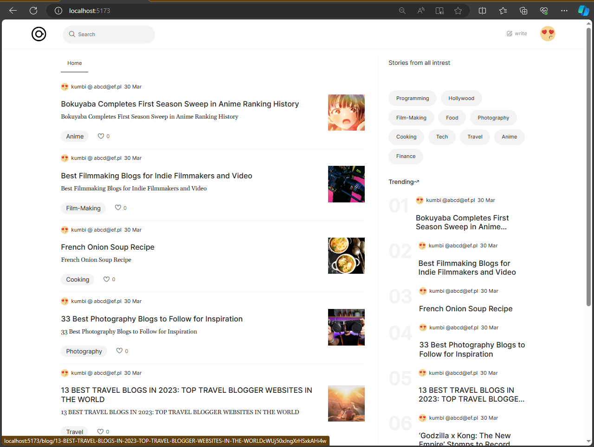
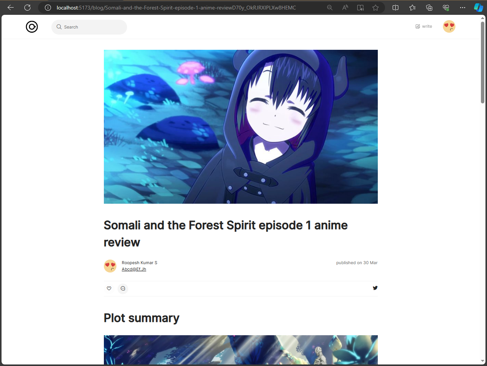

# JOURNEY 🕸

## Fullstack MERN Blogging Website

<a name="readme-top"></a>
<br />
<div align="center">
  <a href="https://github.com/Manojkumbi/journey">
    
  </a>

<h3 align="center">Journey Blog</h3>

  <p align="center">
   This project is a full-stack blogging website built using the MERN (MongoDB, Express.js, React.js, Node.js) stack. It features a modern blog editor using Editor JS, Google Authentication for users, dynamic blog pages with dynamic URLs, a search page for searching blogs and users, and mobile responsiveness with a modern design and fade-in animation on pages.
  </p>
</div>

## Project Screenshots

  



<!-- TABLE OF CONTENTS -->
<details>
  <summary>Table of Contents</summary>
  <ol>
    <li>
        <a href="#built-with">Built With</a>
    </li>
    <li>
      <a href="#getting-started">Getting Started</a>
      <ul>
        <li><a href="#prerequisites">Prerequisites</a></li>
        <li><a href="#installation">Installation</a></li>
      </ul>
    </li>
    <li><a href="#usage">Usage</a></li>
    <li><a href="#roadmap">Roadmap</a></li>
    <li><a href="#contact">Contact</a></li>
  </ol>
</details>


<p align="right">(<a href="#readme-top">back to top</a>)</p>


### Built With

* [![Node][Next.js]][Next-url]
* [![React][React.js]][React-url]
* [![Bootstrap][Bootstrap.com]][Bootstrap-url]

<p align="right">(<a href="#readme-top">back to top</a>)</p>


<!-- GETTING STARTED -->
## Getting Started

Welcome to the Journey project! This guide will help you get started with setting up and running the project on your local machine.


### Prerequisites

Before you begin, ensure you have the following prerequisites installed on your system:
- Node.js and npm: Install Node.js and npm from [here](https://nodejs.org/).

* npm
  ```sh
  npm install npm@latest -g
  ```

### Installation

1. Clone the repo
   ```sh
   git clone https://github.com/Manojkumbi/journey
   ```
2. Install NPM packages in front-end
   ```sh
   npm install
   ```
   run this in the same directory of package.json inside front-end folder
   
4. Install NPM packages in server
   ```sh
   npm install
   ```
    run this in the same directory of package.json inside server folder
   
6. Run Vite server in front-end
   ```sh
   npm run dev
   ```
   run this in the same directory of package.json inside front-end folder
   
7. Run Vite server in front-end
   ```sh
   npm start
   ```
   run this in the same directory of package.json inside server folder
   
<p align="right">(<a href="#readme-top">back to top</a>)</p>


<!-- CONTACT -->
## Contact

KUMARASWAMY S- [Twiter](https://twitter.com/Manojkumbi) -[Email](kumarswamy2803@gmail.com)

Project Link: [click me](https://github.com/Manojkumbi/journey)

<p align="right">(<a href="#readme-top">back to top</a>)</p>


[product-screenshot]: screenshot1.png
[product-screenshot]: screenshot.png
[Next.js]: https://img.shields.io/badge/Nodejs-20232A?style=for-the-badge&logo=nodejs&logoColor=61DAFB
[Next-url]:https://nodejs.org/
[React.js]: https://img.shields.io/badge/React-20232A?style=for-the-badge&logo=react&logoColor=61DAFB
[React-url]: https://reactjs.org/
[Bootstrap.com]: https://img.shields.io/badge/Bootstrap-563D7C?style=for-the-badge&logo=bootstrap&logoColor=white
[Bootstrap-url]: https://getbootstrap.com
